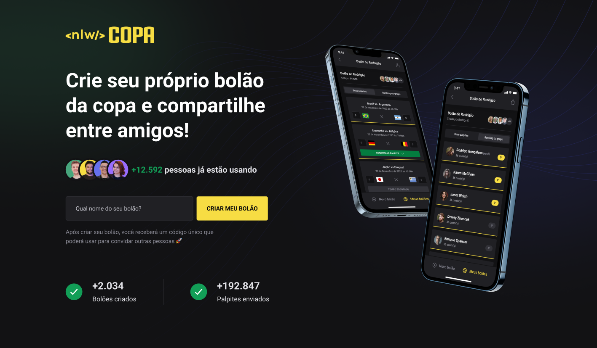

<h1 align="center">NLW COPA - Trilha Ignite | Rocketseat</h1>

<h2>Resultado Aplicação WEB</h2>

<h2>Resultado Aplicação Mobile</h2>

## :memo: Description
* Application of tips for word cup
## :books: Functions
* Project created during the NLW COPA event where a web and mobile platform was developed where we can create pools and make our guesses.

## :wrench: technologies used
* Next Js;
* TypeScript;
* ReactJs;
* React Native;
* Node Js
* Express Js
* Expo
* Tailwind css; 
* Insominia;
* Prisma;
* SQLite;
     
## :rocket: Deploy
<h3>Procedure Start backend --</h3> 

First access the server directory with the command 
<strong>cd server</strong> 
Install backend dependencies 
<strong>npm install</strong> 
Start the backend with the command 
<strong>npm run dev</strong> 

<h3>Procedure Start WEB Application --</h3  

First access the server directory with the command 
<strong>cd web</strong> 
Install WEB Application dependencies 
<strong>npm install</strong> 
Start the WEB Application with the command 
<strong>npm run dev</strong> 

<h3>Procedure start MOBILE application --</h3>  

First access the mobile directory with the command 
<strong>cd mobile</strong> 
Change the IP addresses in the SCREENS folder in the GAME and HOME components. Enter your machine's IP Index.ts files for these 2 components. 
Install MOBILE application dependencies 
<strong>npm install</strong> 
Start the web application with the command 
<strong>expo start</strong> 

## :handshake: Collaborators
<table>
  <tr>
    <td align="center">
      <a href="http://github.com/oducoelho">
         
        
          <b>oducoelho</b>
        
      </a>
    </td>
  </tr>
</table>
