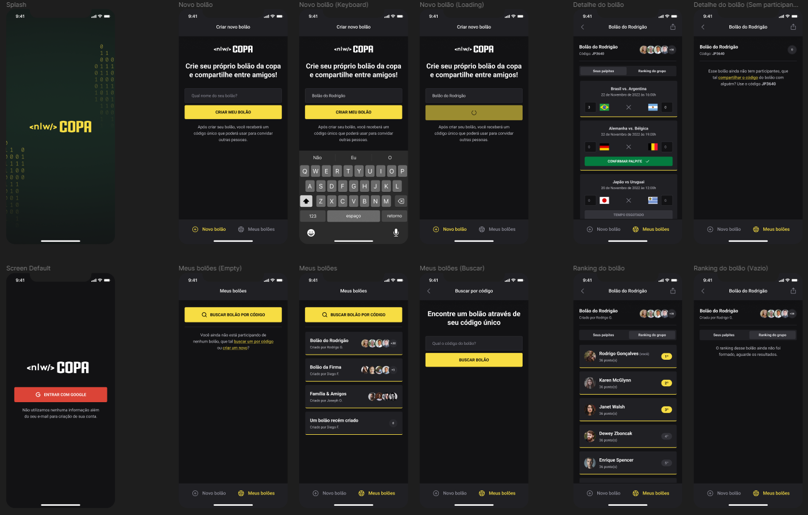

<h1 align="center">NLW COPA - Trilha Ignite | Rocketseat</h1>

<h2>Resultado Aplicação WEB</h2>

<h2>Resultado Aplicação Mobile</h2>

## :memo: Description
* Application of tips for word cup
## :books: Functions
* Project created during the NLW COPA event where a web and mobile platform was developed where we can create pools and make our guesses.

## :wrench: technologies used
* Next Js;
* TypeScript;
* ReactJs;
* React Native;
* Node Js
* Express Js
* Expo
* Tailwind css; 
* Insominia;
* Prisma;
* SQLite;
     
## :rocket: Deploy
Procedure Start backend --

First access the server directory with the command
cd server
Install backend dependencies
npm install
Start the backend with the command
npm run dev

Procedure Start WEB Application --

First access the server directory with the command
cd web
Install WEB Application dependencies
npm install
Start the WEB Application with the command
npm run dev

Procedure start MOBILE application --

First access the mobile directory with the command
cd mobile
Change the IP addresses in the SCREENS folder in the GAME and HOME components. Enter your machine's IP Index.ts files for these 2 components.
Install MOBILE application dependencies
npm install
Start the web application with the command
expo start
## :handshake: Collaborators
<table>
  <tr>
    <td align="center">
      <a href="http://github.com/oducoelho">
         
        
          <b>oducoelho</b>
        
      </a>
    </td>
  </tr>
</table>
